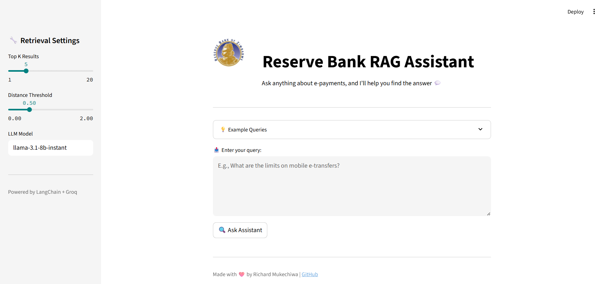

# 💰 Smartbank Assistant

An AI-powered assistant for the Reserve Bank of Zimbabwe that answers public queries about electronic payments using Retrieval-Augmented Generation (RAG) and Groq's high-speed LLMs.

This assistant improves public financial awareness and reduces the risk of fraud, delays, or poor decision-making in digital banking.

---

##  Overview

Smartbank Assistant is designed to serve the general public with instant, accurate, and document-backed responses related to e-payment systems such as ZIPIT, mobile banking, and regulatory policies.

Using a combination of:

- **LangChain** for orchestration
- **ChromaDB** for document similarity search
- **HuggingFace embeddings**
- **Groq (LLaMA 3)** for fast inference
- **Streamlit** for a clean, interactive UI

the app retrieves and reasons over relevant documents to answer user questions with up-to-date insights.

---

## 📁 Project Structure

```plaintext
SMARTBANK-ASSISTANT/
├── ai_code/
│   ├── paths.py
│   ├── prompt_builder.py
│   ├── utils.py
│   ├── vector_db_ingest.py
│   └── vector_db_loader.py
├── assets/
│   └── RESERVE_BANK_OF_ZIMBABWE_LOGO.png
├── data/
│   └── (PDFs, markdown, or text files to embed)
├── outputs/
│   └── (LLM responses, logs, etc.)
├── .env                 # Contains GROQ_API_KEY
├── .gitignore
├── app.py               # Streamlit interface
├── Dockerfile           # Container setup
├── LICENSE              # MIT License
├── requirements.txt     # Python dependencies
└── README.md            # This file
```

---

## ⚙️ Installation

### 📦 Option 1: Local Python Setup

```bash
# 1. Clone the repo
git clone https://github.com/richardmukechiwa/smartbank-assistant.git
cd smartbank-assistant

# 2. Create & activate environment
conda create -n smartai python=3.12 -y
conda activate smartai

# 3. Install dependencies
pip install -r requirements.txt

# 4. Set up your .env file
echo "GROQ_API_KEY=your-api-key-here" > .env

# 5. Run the app
streamlit run app.py
```

---

### 🐳 Option 2: Docker

```bash
# Build the container
docker build -t smartbank-assistant .

# Run it on port 8501
docker run -p 8501:8501 --env-file .env smartbank-assistant
```

---

## 💡 Usage

Once the app is running, open it at:  
**[http://localhost:8501](http://localhost:8501)**

Type your question and click **"Ask Assistant"**.

### ✅ Sample Queries:

- What are the limits on mobile e-transfers?
- How do I register for ZIPIT Smart?
- Are there charges for cross-border transfers?
- How can I protect my mobile banking information?
- What should I check before downloading a banking app?
- Why should I avoid public Wi-Fi for mobile banking?

---

## 📸 Screenshot

 

---

## 📹 Video Walkthrough
 

---

##  License

This project is licensed under the **MIT License**.  
See [LICENSE](LICENSE) for more information.

---

## 🙌 Credits

Made with ❤️ by [Richard Mukechiwa](https://github.com/richardmukechiwa)  
*Powered by LangChain, ChromaDB, Groq, and Streamlit*

---

## 🔗 Links

- [🔍 LangChain](https://www.langchain.com/)
- [💾 ChromaDB](https://www.trychroma.com/)
- [🚀 Groq API](https://console.groq.com/)
- [🎨 Streamlit](https://streamlit.io/)
